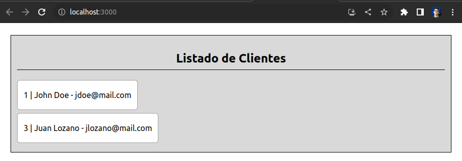

# react-frontend-app

This is the front-end project of the backend `laravel-backend-app`.

## Prerequisites

You need:
* Node.js 18
* Axios (`npm install axios`)

## How to Scaffold this Project?

To create the basic structure of project and initial configurations, run next command:
```bash
npm init react-app react-frontend-app
```

## How to Test this Project?

You need to run first the back-end [laravel-backend-app](https://github.com/lozanotux/laravel-backend-app) running next command:
```bash
php artisan serve
```

Then, you need to start up this React project running next command:
```bash
npm start
```

After that, you will see something like this:

